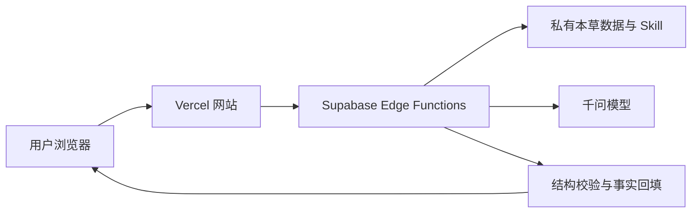

# 常见中草药 AI 图谱

> 公开体验与技术说明仓库。本仓库不包含生产系统源码、私有数据、AI 提示词或业务 Skill。

[**立即体验线上版**](https://zhongyao-ai-v2.vercel.app/)

## 项目简介

“常见中草药 AI 图谱”将中草药档案、可视化图谱与 AI 交互结合，用于探索药材的原书信息、分类关系、配伍逻辑与趣味化内容。

主要体验包括：

- 240 味常见中草药数字图谱。
- 分类导航、植物图鉴与仿真原书查阅。
- AI 草药问答与病证导航。
- 相似替代、配伍网络、药性量化和多药联用图谱。
- 趣味中药人格测试。
- 官方托管与用户自有千问 API Key 模式。

## 实现方式概览

浏览器负责交互和可视化；私有数据检索、提示词、业务规则、模型调用和输出校验保留在服务端。更多说明见 [系统架构](docs/ARCHITECTURE.md)。

## 本仓库公开什么

- 产品介绍与功能导览。
- 不涉及核心实现细节的系统架构。
- 隐私、安全与 BYOK 设计原则。
- 经审核的截图、演示材料和版本记录。

## 本仓库不公开什么

- 生产前端与 Supabase Edge Function 源码。
- 系统提示词、业务 Skill、召回、评分和校验规则。
- 完整药材数据、数据导入工具和数据库迁移。
- 生产配置、密钥、内部测试和运维记录。

详细边界见 [公开内容边界](docs/OPEN_BOUNDARY.md)。

## 安全与隐私

用户自有 API Key 仅用于当前浏览器标签页和单次服务端请求，不应写入业务数据库或应用日志。详见 [隐私与安全](docs/PRIVACY_SECURITY.md)。

## 仓库定位与权利

这是一个“公开体验、公开说明、核心闭源”的展示仓库，不是生产源码镜像。除非具体文件另有明确授权，本仓库内容不默认授予复制、修改、再发布或商业使用权。详见 [权利与授权说明](RIGHTS_AND_LICENSE.md)。

## 免责声明

本项目用于文化展示、知识检索与技术交流，不构成医疗诊断、处方或用药建议。身体不适、孕期、慢性病或用药相关问题，请咨询具备资质的专业人员。
