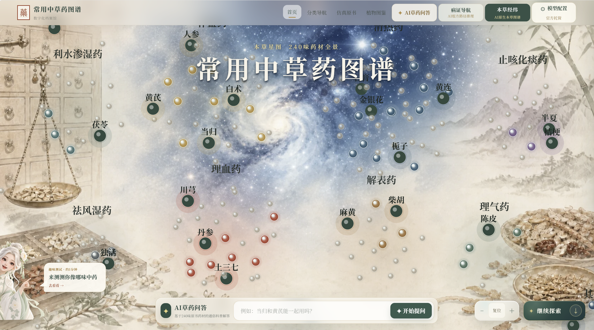
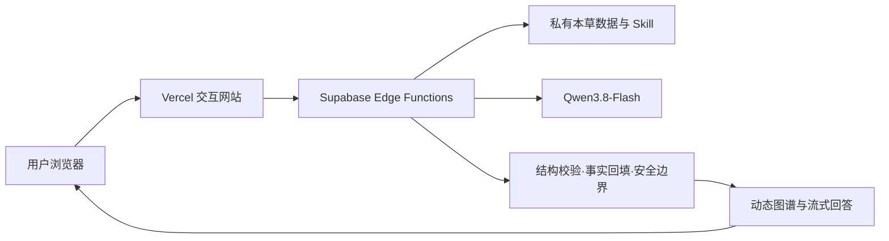

# 🌿 常见中草药 AI 图谱 · 本草星图

### 把 240 味中草药放进一片可探索的星云

**让原书证据、知识图谱与 AI 推理，在同一个东方美学网页里相遇。**

### [🚀 立即进入本草星图](https://zhongyao-ai-v2.vercel.app/) · [🧠 了解 AI 架构](docs/ARCHITECTURE.md) · [🔐 了解 BYOK](docs/PRIVACY_SECURITY.md)

无需安装 · 打开即用 · 支持用户自有千问 API Key

---

## 不只是一个中药材目录

传统的中草药数字化，往往止于“搜索一味药，读完一张卡片”。

本草星图想尝试另一种可能：从一味药出发，沿着分类、功效、配伍、药性和原书证据向外漫游；让 AI 不只输出一段文字，而是把推理结果变成可点击、可追溯、可继续追问的动态图谱。

> **从“查一味药”到“看懂一张本草关系网”。**

## 一眼看懂这个项目

| 你可以做什么              | 体验到什么                           |
| ------------------- | ------------------------------- |
| 🌌 **漫游 240 味本草星云** | 17 类药材以星团方式展开，缩放、拖拽、点击探索        |
| 📖 **翻阅仿真原书**       | 从图谱节点直达对应药材档案，保留证据来源            |
| 🧠 **向 AI 追问本草**    | 回答不只给结论，还组织原书依据、逻辑与安全边界         |
| 🧪 **生成五类 AI 图谱**   | 病证导航、相似替代、配伍网络、药性量化、多药联用        |
| 🔭 **继续追问图谱**       | 基于当前图谱快照对话，不让每轮交互重新开始           |
| 🔑 **切换自有 Key**     | 官方托管和 BYOK 共用同一套模型、Skill、证据与校验链 |
| 🎭 **测测你像哪味中药**     | 把本草知识变成更轻松、更愿意分享的人格体验           |

## 为什么它值得一看

### 01 · AI 不只是聊天窗口

在这里，AI 是图谱的语义引擎：它参与候选审阅、关系解释、药性拆解、风险分析和多轮追问，最终交付的是可交互图谱结构，而不是一大段模型文本。

### 02 · 模型推理与原书证据分工

千问负责语义理解和结构化推演；程序负责范围限制、数学校准、业务校验和原书回填。这不仅是“让模型回答”，而是一条可约束的 AI Native 工作流。

### 03 · 东方本草不必长成数据库后台

星云、水墨、仿真原书与现代 Agent 交互被放进同一个视觉系统。它首先是一个愿意让人停留和探索的网站，其次才是一组功能的集合。

## 30 秒体验路线

1. 打开 [线上版](https://zhongyao-ai-v2.vercel.app/)，拖动首屏星云，随便点开一味药。
2. 在底部问答框输入：`当归和黄芪能一起用吗？`
3. 进入“本草经纬”，尝试生成一张配伍网络或多药联用图谱。
4. 点击图谱节点查看证据，再用右侧对话继续追问。
5. 如果你只想轻松一下，让首页左下角的本草少女带你去测一测“你像哪味中药”。

## 实现方式概览

浏览器负责交互和可视化；私有数据检索、提示词、业务规则、模型调用和输出校验保留在服务端。官方托管与用户自有 Key 只切换本次模型费用凭证，不分叉推理链路。

👉 [阅读完整架构说明](docs/ARCHITECTURE.md)

## 技术关键词

`AI Native` · `Knowledge Graph` · `Qwen3.8-Flash` · `Supabase Edge Functions` · `Vercel` · `BYOK` · `Streaming UI` · `Structured Output` · `Traditional Chinese Medicine`

## 关于这个公开仓库

这是“**公开体验、公开说明、核心闭源**”的项目展示仓库，不是生产源码镜像。

### 本仓库公开

- 产品介绍、体验入口与高层系统架构。
- 隐私、安全、BYOK 与 AI 工作流的设计思路。
- 经审核的展示材料、公开记录与项目文档。

### 生产核心保留在私有仓库

- 生产前端与 Supabase Edge Function 源码。
- 系统提示词、业务 Skill、召回、评分和校验规则。
- 完整药材数据、数据导入工具、运维配置与内部测试。

👉 [查看完整公开边界](docs/OPEN_BOUNDARY.md) · [查看权利与授权说明](RIGHTS_AND_LICENSE.md)

## 隐私设计

用户自有 API Key 仅用于当前浏览器标签页和单次服务端请求，不应写入业务数据库或应用日志。官方托管与 BYOK 共用同一服务端推理和校验链路。

👉 [阅读隐私与安全原则](docs/PRIVACY_SECURITY.md)

## 喜欢这个项目？

如果它让你对“**AI × 中医药数字化**”多了一点新想象，欢迎点亮一颗 **⭐ Star**。

你的 Star 会帮助更多人看见这个实验，也会推动后续的视觉、交互与 AI 场景继续迭代。

- 🐛 体验问题与建议：[GitHub Issues](https://github.com/SweetCakesydw/bencao-ai-atlas-open/issues)
- 💬 常见问题：[FAQ](docs/FAQ.md)
- 🤝 公开文档贡献：[CONTRIBUTING.md](CONTRIBUTING.md)

## 免责声明

本项目用于文化展示、知识检索与技术交流，不构成医疗诊断、处方或用药建议。身体不适、孕期、慢性病或用药相关问题，请咨询具备资质的专业人员。
